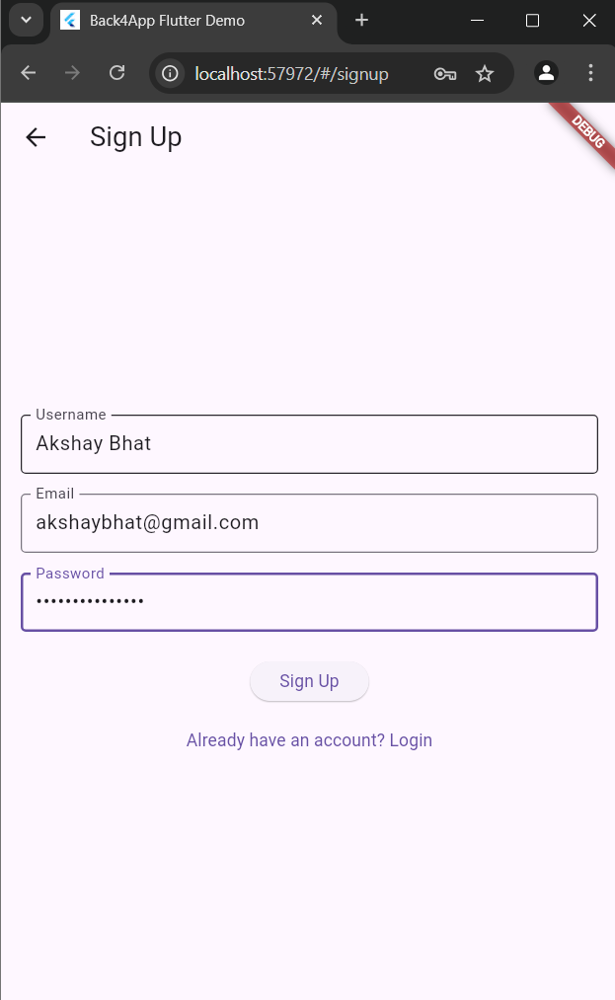
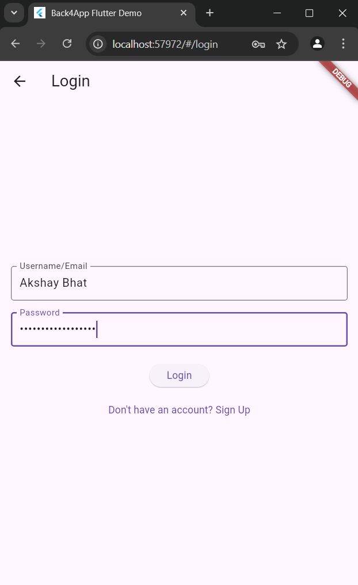
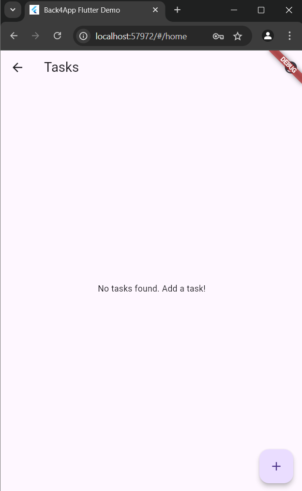
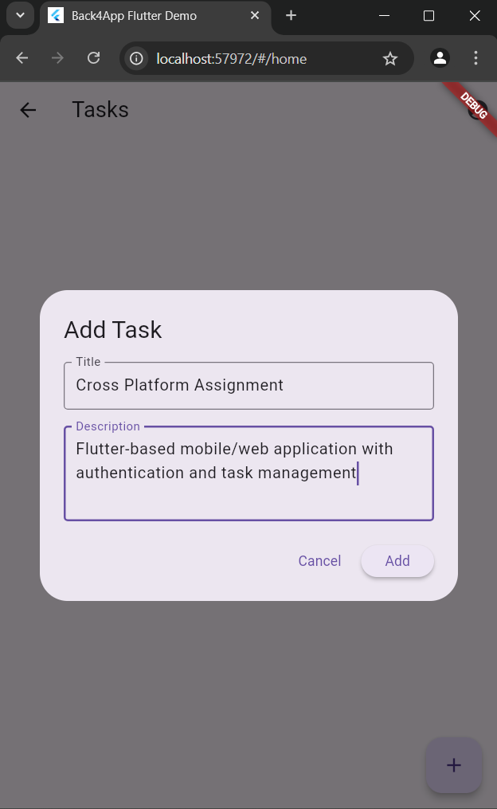
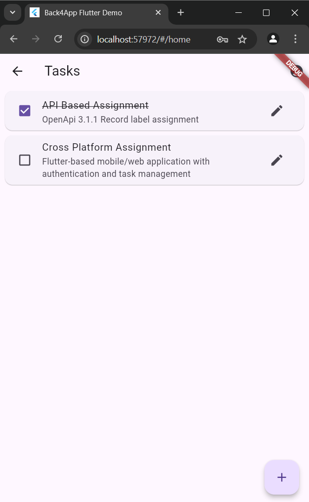
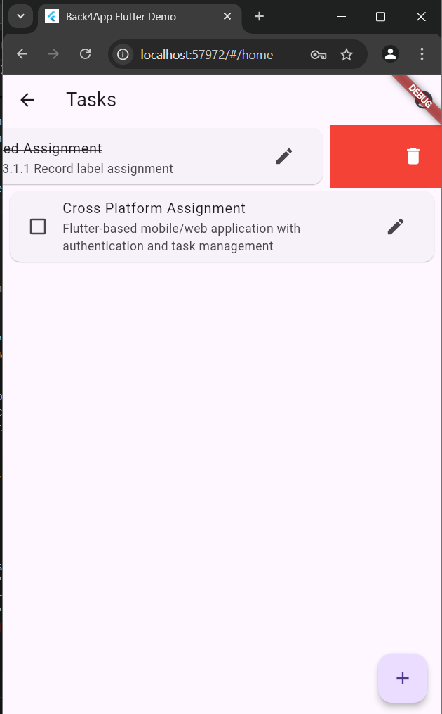
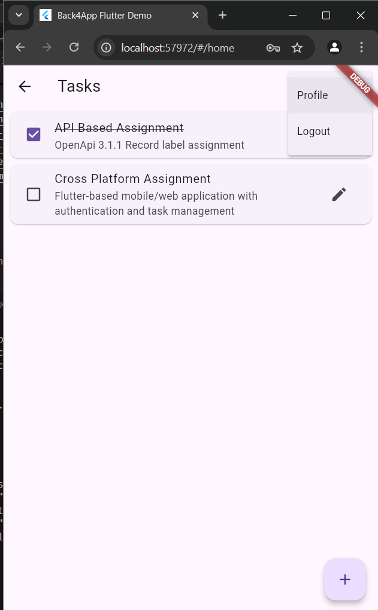
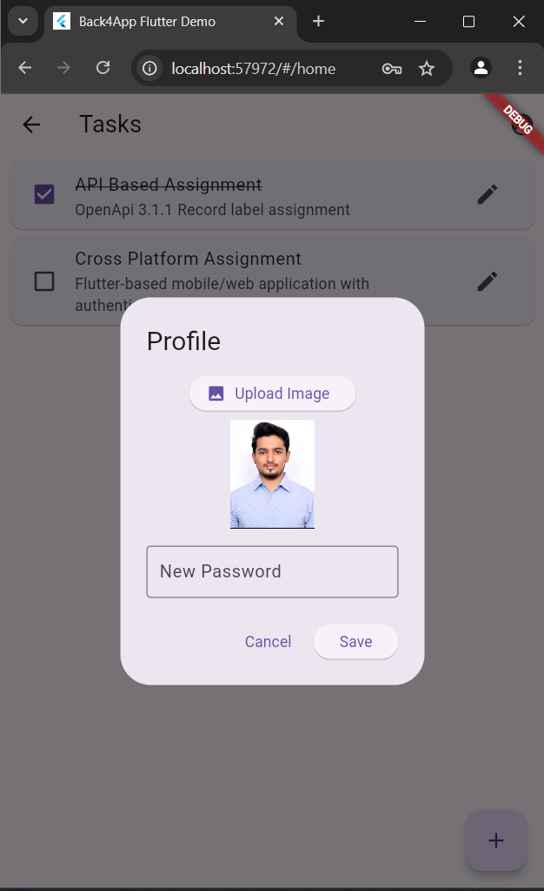

# Flutter Back4App Task Manager

This is a Flutter-based mobile/web application with authentication and task management powered by [Back4App (Parse Server)](https://www.back4app.com/). Users can sign up, log in, manage tasks, update their profile image, and change their password.

---

## 🚀 Features

- ✅ User Signup & Login using Parse Server
- ✅ Add, Edit, Delete Tasks (CRUD)
- ✅ Task Completion Status Toggle
- ✅ User Session Management
- ✅ Profile Menu with:
  - Password Change
  - Profile Image Upload (stored in `_User`)
  - Logout
- ✅ Works on Android, iOS, Web

---

## 📦 Tech Stack

- **Flutter** (Mobile/Web)
- **Back4App** (Parse Server SDK)
- [`parse_server_sdk_flutter`](https://pub.dev/packages/parse_server_sdk_flutter)
- [`image_picker`](https://pub.dev/packages/image_picker)
- `dart:io`, `dart:typed_data` for local file/image handling

---

## 🛠 Setup Instructions

### 1. Clone the Repository

```bash
git clone https://github.com/your-username/flutter-back4app-task-manager.git
cd flutter-back4app-task-manager
```

### 2. Install Dependencies

```bash
flutter pub get
```

### 3. Back4App Configuration

- Sign up at [https://www.back4app.com](https://www.back4app.com)
- Create a new Parse app
- Retrieve your:
  - Application ID
  - Client Key
  - Server URL

### 4. Update `main.dart`

Replace the placeholder values with your own in the `main()` function:

```dart
await Parse().initialize(
  'YOUR_APPLICATION_ID',
  'https://parseapi.back4app.com/',
  clientKey: 'YOUR_CLIENT_KEY',
  debug: true,
  autoSendSessionId: true,
);
```

### 5. Run the App

For Android/iOS:
```bash
flutter run
```

For Web:
```bash
flutter run -d chrome
```

---

## 🧪 Functionality Overview

### 🔐 Authentication
- Sign up and login using email/username and password.
- Authenticated users stay signed in using `ParseUser.currentUser()`.

### ✅ Task Management
- Users can add, edit, delete, and toggle completion of tasks.
- Each task is linked to the user via a Pointer (`user` → `_User`).
- Only tasks for the logged-in user are displayed.

### 👤 Profile & Password
- The user icon in the app bar opens a dropdown with:
  - Profile: change password, upload profile image
  - Logout
- Profile images are stored in the `profileImage` field of the `_User` table as a `File`.
- Password is updated via:
  ```dart
  _currentUser.set('password', newPassword);
  await _currentUser.save();
  ```

⚠️ After updating the password, log the user out manually:
```dart
await _currentUser.logout();
Navigator.pushReplacementNamed(context, '/login');
```

---

## 📁 Directory Structure

```
lib/
├── main.dart
├── models/
│   └── task.dart
├── screens/
│   ├── login_screen.dart
│   ├── signup_screen.dart
│   └── home_screen.dart
├── widgets/
│   ├── add_task_dialog.dart
│   └── task_item.dart
```

---

## 📷 Screenshots

### 🔹 Sign Up


### 🔹 Login


### 🔹 Home Page


### 🔹 Add Tasks


### 🔹 Tasks List


### 🔹 Delete Option


### 🔹 Profile Option


### 🔹 Save Profile

---

## 🔒 Permissions

For Android (in `AndroidManifest.xml`):

```xml
<uses-permission android:name="android.permission.READ_EXTERNAL_STORAGE"/>
<uses-permission android:name="android.permission.CAMERA"/>
```

For iOS (in `Info.plist`):

```xml
<key>NSPhotoLibraryUsageDescription</key>
<string>We need access to your photo library to upload profile images.</string>
```

---

## ✍️ Author

**G M Akshay Bhat**  
[GitHub](https://github.com/GMAkshayBhat) • [LinkedIn](https://in.linkedin.com/in/g-m-akshay-bhat-358a32ba)

---

## 📄 License

This project is licensed under the MIT License - see the [LICENSE](LICENSE) file for details.
